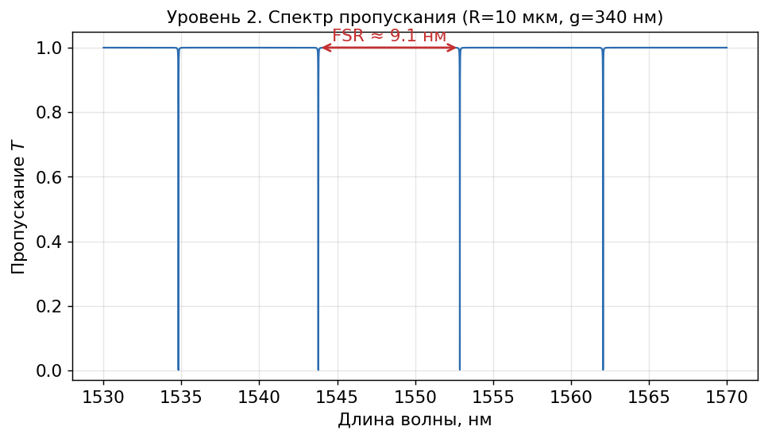

# Ring Resonator Tutorial

An educational walkthrough of **all-pass microring resonator** physics on the silicon-photonics (SOI) platform — from coupled-mode theory all the way to picking the device geometry. Every figure is produced by a single, self-contained Python script you can run yourself.

> Companion / educational on-ramp to the `ring-resonator-toolkit` project. The tutorial model is intentionally simplified for teaching (constant effective index, point coupling); the toolkit carries the rigorous version.



## What's inside

The guide is built in five levels, each going one step further — and each with a figure and runnable code:

1. **Coupling between bus and ring** — self/cross coupling `t, κ`, energy conservation, round-trip phase and loss.
2. **Transmission spectrum** — the master formula `T(λ)` and the resonance condition.
3. **Key metrics** — Free Spectral Range (FSR), loaded Q-factor, extinction ratio (ER), and the under/critical/over coupling regimes.
4. **Geometry → physics** — how radius maps to loss `α(R)` (incl. bending loss) and how gap maps to coupling `κ(g)`.
5. **Inverse design** — given a target FSR and Q, solve for radius and gap; a design map in the (R, gap) plane.

The full tutorial text is in [`ring_resonators_tutorial.md`](ring_resonators_tutorial.md) (in Russian).

## Quick start

```bash
python -m venv .venv
# Windows:  .venv\Scripts\Activate.ps1
# macOS/Linux:  source .venv/bin/activate
pip install -r requirements.txt
python ring_tutorial.py
```

This regenerates all five figures into `images/`.

## Repository layout

```
ring-resonator-tutorial/
├── README.md
├── LICENSE
├── requirements.txt
├── ring_tutorial.py             # physics functions + figure generation
├── ring_resonators_tutorial.md  # the teaching guide (5 levels)
└── images/                      # generated figures used in the guide
```

## The physics, in one paragraph

A microring resonator is a closed waveguide loop coupled to a straight bus waveguide. Light mostly stays in the bus, but a fraction couples into the ring across a narrow gap. When a wavelength fits a whole number of times into the ring's optical length, it builds up over many round trips — a resonance — leaving a dip in the transmission spectrum. The spacing of those dips (FSR) is set by the ring radius; their depth (ER) and sharpness (Q) are set by the balance between coupling and round-trip loss. Picking a radius and a gap to hit target FSR and Q is the design problem this guide walks through.

## Platform constants (used in examples)

SOI strip waveguide, 220 × 500 nm cross-section, TE mode, λ ≈ 1550 nm: `n_eff ≈ 2.45`, `n_g ≈ 4.20`, propagation loss ≈ 2 dB/cm. These are typical teaching values; a real design takes them from a mode solver.

## License

MIT — see [`LICENSE`](LICENSE).
