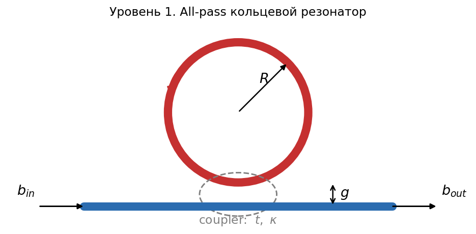
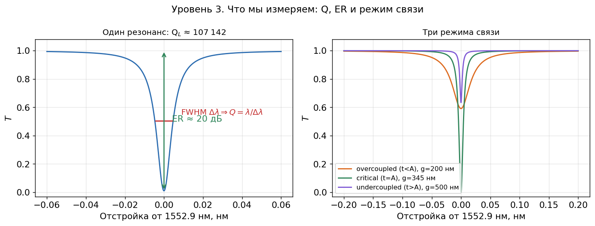
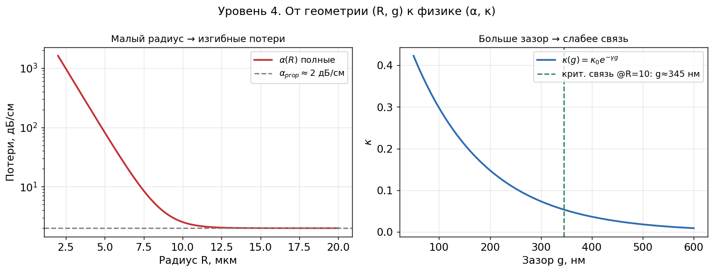
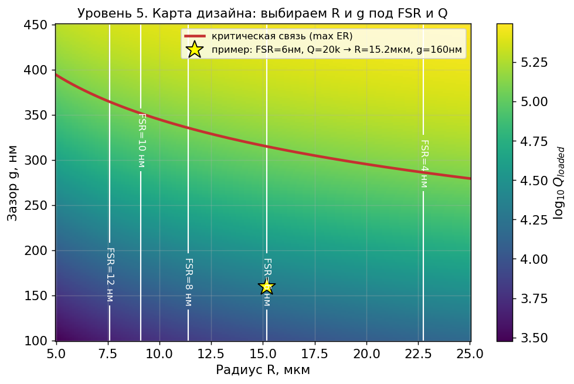

# Кольцевые резонаторы: от физики к геометрии

*Короткая методичка для 2 курса. Что такое кольцевой резонатор, как он работает и как посчитать его «руками» на Python.*

Кольцевой резонатор — это замкнутый волновод (кольцо), к которому близко подведён прямой волновод (bus). Свет в основном бежит по прямому волноводу, но небольшая часть «перепрыгивает» в кольцо через узкий зазор. Если длина волны такая, что в кольцо укладывается **целое число длин волн**, свет внутри усиливается за много оборотов — это **резонанс**. На этих длинах волн в спектре пропускания появляются глубокие провалы. Именно поэтому кольца используют как фильтры, сенсоры и модуляторы.

**Что понадобится:** базовая Python (numpy, matplotlib), комплексная экспонента $e^{i\varphi}$, модуль $|z|^2$, производная. Всё остальное разберём по ходу.

**Платформа в примерах:** кремниевый волновод SOI strip 220×500 нм, TE-мода, $\lambda \approx 1550$ нм.

## Как запустить код

```bash
pip install numpy matplotlib
python ring_tutorial.py     # построит все 5 рисунков в папку images/
```

В каждом разделе ниже — короткий фрагмент, использующий функции из `ring_tutorial.py`. Формулы в `$...$` рендерятся прямо на GitHub.

---

## Уровень 1. Как связаны прямой волновод и кольцо



**Идея.** В области сближения (coupler) часть амплитуды поля переходит из bus в кольцо, часть проходит мимо. Описываем это двумя числами:

- $t$ — **self-coupling**: доля амплитуды, прошедшая мимо кольца;
- $\kappa$ — **cross-coupling**: доля амплитуды, перешедшая в кольцо.

Свет не теряется в самом coupler'е, поэтому энергия сохраняется:

$$t^2 + \kappa^2 = 1$$

За **один оборот** по кольцу длиной $L = 2\pi R$ поле, во-первых, набирает фазу, во-вторых, немного затухает:

$$\text{фаза за оборот:}\quad \varphi = \frac{2\pi\, n_{\text{eff}}\, L}{\lambda}, \qquad \text{амплитуда выживает в}\quad A = e^{-\alpha L/2}$$

где $n_{\text{eff}}$ — эффективный индекс моды (насколько «медленно» свет идёт в волноводе), $\alpha$ — потери на единицу длины, $R$ — радиус кольца, $\lambda$ — длина волны.

```python
from ring_tutorial import round_trip_length, amplitude_loss, kappa, self_coupling

R, gap = 10.0, 0.30                 # радиус 10 мкм, зазор 300 нм
print("Длина оборота L =", round_trip_length(R), "мкм")
print("Связь kappa =", kappa(gap), " прошло мимо t =", self_coupling(gap))
print("Выживает за оборот A =", amplitude_loss(R))
```

**Что запомнить:** всё устройство задаётся всего двумя «ручками» — фазой (через $R$ и $n_{\text{eff}}$) и связью (через зазор). К ним мы и сведём дизайн.

---

## Уровень 2. Спектр пропускания и условие резонанса


Если аккуратно сложить поле, прошедшее мимо, с полем, вернувшимся из кольца после каждого оборота (бесконечная сумма по оборотам), получится **главная формула** — пропускание $T = |b_{out}/b_{in}|^2$:

$$T(\lambda) = \frac{t^2 - 2tA\cos\varphi + A^2}{1 - 2tA\cos\varphi + t^2 A^2}$$

**Резонанс** наступает, когда $\cos\varphi = 1$, то есть $\varphi = 2\pi m$ для целого $m$. Это и есть условие «целое число длин волн в кольце»:

$$m\,\lambda_m = n_{\text{eff}}\, L$$

На резонансе знаменатель и числитель минимальны — в спектре виден провал.

```python
import numpy as np
from ring_tutorial import transmission

lam = np.linspace(1.530, 1.570, 60000)   # длины волн, мкм
T = transmission(lam, R=10.0, gap=0.34)
print("Минимум пропускания:", T.min())    # глубина провала на резонансе
```

**Что видно на рисунке:** ряд одинаковых провалов через равные промежутки. Это спектральный «отпечаток» кольца. Дальше мы научимся читать из него три числа.

---

## Уровень 3. Что мы измеряем: FSR, Q и ER



Из спектра вытаскивают три ключевые характеристики (FOMs — figures of merit).

**1) FSR (Free Spectral Range)** — расстояние между соседними резонансами:

$$\text{FSR} = \frac{\lambda^2}{n_g\, L} = \frac{\lambda^2}{n_g\, 2\pi R}$$

Здесь $n_g = n_{\text{eff}} - \lambda\,\dfrac{dn_{\text{eff}}}{d\lambda}$ — **групповой индекс** (поправка на то, что $n_{\text{eff}}$ чуть зависит от $\lambda$; это дисперсия). FSR обратно пропорционально радиусу: **меньше кольцо → шире FSR**.

**2) Q-фактор (добротность)** — насколько «острый» резонанс. Измеряется как отношение длины волны к ширине провала на половине глубины (FWHM):

$$Q = \frac{\lambda_{\text{res}}}{\Delta\lambda_{\text{FWHM}}}$$

Физически Q складывается из потерь в кольце и утечки через coupler:

$$\frac{1}{Q_{\text{loaded}}} = \frac{1}{Q_{\text{intrinsic}}} + \frac{1}{Q_{\text{coupling}}}$$

**3) ER (Extinction Ratio)** — глубина провала в децибелах: $\text{ER} = -10\log_{10}(T_{\min}/T_{\max})$.

**Критическая связь.** Глубина провала максимальна (в идеале до нуля), когда связь точно равна потерям за оборот, $t = A$:

$$\kappa^2_{\text{crit}} = 1 - A^2 \approx \alpha L$$

Левая панель рисунка — один резонанс с отмеченными FWHM и ER. Правая — три режима: **overcoupled** (связь сильнее потерь, провал широкий и неглубокий), **critical** (самый глубокий), **undercoupled** (связь слабее потерь, провал узкий и неглубокий).

```python
from ring_tutorial import FSR, Q_loaded, extinction_ratio_dB, critical_gap

print("FSR  =", FSR(10.0) * 1000, "нм")
print("Q    =", Q_loaded(10.0, 0.33))
print("ER   =", extinction_ratio_dB(10.0, 0.33), "дБ")
print("Критический зазор @R=10:", critical_gap(10.0) * 1000, "нм")
```

---

## Уровень 4. От геометрии к физике



Инженер крутит **геометрию** ($R$ и зазор $g$), а формулы выше работают с **физикой** ($\alpha$, $\kappa$). Связь такая:

**Радиус → потери.** Есть постоянные потери распространения $\alpha_{\text{prop}}$ (для нашего SOI ≈ 2 дБ/см). Но у **малых** колец добавляются **изгибные потери** — свет «выплёскивается» наружу на крутом повороте:

$$\alpha(R) = \alpha_{\text{prop}} + \alpha_{\text{bend}}(R), \qquad \alpha_{\text{bend}}(R) = \alpha_0\, e^{-(R - R_{\text{crit}})/R_0}$$

Левая панель: ниже ≈ 8–10 мкм изгибные потери резко растут — слишком маленькое кольцо делать нельзя.

**Зазор → связь.** Поле за пределами волновода спадает экспоненциально, поэтому связь экспоненциально зависит от зазора:

$$\kappa(g) = \kappa_0\, e^{-\gamma g}$$

где $\gamma \approx 7\ \text{мкм}^{-1}$ для SOI. Правая панель: **шире зазор → слабее связь**. Зная нужную $\kappa$, легко найти зазор: $g = -\frac{1}{\gamma}\ln(\kappa/\kappa_0)$.

```python
import numpy as np
from ring_tutorial import kappa, critical_gap

g = np.linspace(0.05, 0.6, 100)
print("kappa при g=200 нм:", kappa(0.2))
print("Для критической связи @R=10 нужен зазор:", critical_gap(10.0) * 1000, "нм")
```

> **Продвинутый момент (для любопытных).** В точечной модели мы считаем $\kappa(g)$ только от зазора. На самом деле свет связывается на дуге конечной длины, и эффективная длина связи слабо растёт с радиусом, $L_{\text{eff}} \sim \sqrt{R/\gamma}$. Для учебных оценок этим пренебрегают.

---

## Уровень 5. Обратная задача: подбираем R и зазор под спецификацию



Теперь идём **наоборот**: заданы целевые FSR и Q — найти геометрию.

1. **Радиус из FSR:** $\;R = \dfrac{\lambda^2}{2\pi n_g\,\text{FSR}}$.
2. **Проверка потолка:** считаем $Q_{\text{intrinsic}}(R)$. Если цель $Q_{\text{target}} \ge Q_{\text{intrinsic}}$ — **так не получится**, потери в кольце не дадут такую добротность.
3. **Нужная связь:** из $\frac{1}{Q_{\text{loaded}}} = \frac{1}{Q_{\text{int}}} + \frac{1}{Q_{\text{coup}}}$ находим $Q_{\text{coup}}$, затем $\kappa$.
4. **Зазор:** $g = -\frac{1}{\gamma}\ln(\kappa/\kappa_0)$.
5. **Проверки:** зазор $\ge 50$ нм (предел литографии), близость к критической связи (если нужен большой ER).

На карте: **цвет** — добротность $Q$ (растёт с $R$ и зазором), **белые линии** — постоянный FSR (зависит только от $R$), **красная кривая** — критическая связь (максимальный ER), **звезда** — пример найденного дизайна.

```python
from ring_tutorial import design_for_FSR_Q

d = design_for_FSR_Q(FSR_target=0.006, Q_target=2.0e4)   # FSR=6 нм, Q=20000
print(f"R = {d['R']:.1f} мкм,  зазор = {d['gap']*1000:.0f} нм,  выполнимо: {d['feasible']}")
# -> R ≈ 15.2 мкм, зазор ≈ 160 нм
```

---

## Что попробовать самому (упражнения)

1. Постройте спектр для $R = 5$ и $R = 20$ мкм. Как меняется FSR? Сверьте с формулой.
2. Зафиксируйте $R = 10$ мкм и меняйте зазор от 200 до 500 нм. Найдите зазор, где провал глубже всего, — это и есть критическая связь.
3. Сделайте обратный дизайн под FSR = 10 нм и Q = 50 000. Получится ли уложиться в предел зазора 50 нм?
4. Добавьте в `transmission` потери $\alpha(R)$ с изгибным слагаемым из уровня 4 и посмотрите, при каком радиусе резонансы «размываются».

---

### Краткий словарь обозначений

| Символ | Что это | Единицы |
|---|---|---|
| $R$ | радиус кольца | мкм |
| $L = 2\pi R$ | длина оборота | мкм |
| $g$ | зазор bus–кольцо | мкм / нм |
| $t,\ \kappa$ | прошло мимо / перешло в кольцо | — |
| $\alpha$ | потери распространения | 1/мкм |
| $A = e^{-\alpha L/2}$ | выживание амплитуды за оборот | — |
| $n_{\text{eff}}$ | эффективный индекс | — |
| $n_g$ | групповой индекс | — |
| FSR, Q, ER | межрезонансный интервал, добротность, глубина | нм, —, дБ |
